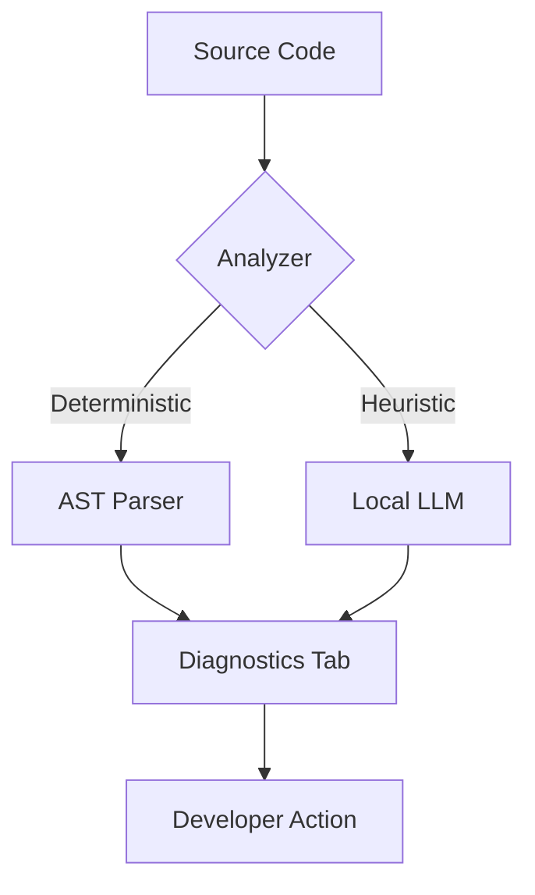

<div align="center">

# 🛡️ AI Code Scanner

### *Privacy-First, Local-LLM Powered Code Intelligence for VS Code*

[](https://www.google.com/search?q=https://marketplace.visualstudio.com/)
[](https://www.google.com/search?q=https://nodejs.org/)
[](https://www.google.com/search?q=https://opensource.org/licenses/MIT)
[](https://www.google.com/search?q=https://ollama.com/)

**Stop sending your proprietary code to the cloud.** AI Code Scanner combines deterministic AST-based analysis with local LLM orchestration to give you professional-grade insights right on your machine.

[Explore Features](https://www.google.com/search?q=%23-core-capabilities) • [Installation](https://www.google.com/search?q=%23-quick-start) • [Architecture](https://www.google.com/search?q=%23-under-the-hood)


</div>

## 🚀 Overview

**AI Code Scanner** is a lightweight VS Code extension designed for developers who demand high-performance static analysis without sacrificing privacy. By utilizing **Node.js** and local models like **Qwen2.5-Coder** via **Ollama**, this tool identifies security vulnerabilities, calculates complexity, and suggests refactors—all without an internet connection.

-----

## 🛠️ Core Capabilities

### 1\. 🔍 Code Understanding & Logic

  * **Contextual Explanations:** Get deep dives into complex functions and class hierarchies.
  * **Dependency Tracing:** Map out module imports and execution flows instantly.
  * **Entry Point Detection:** Quickly identify where the logic begins in unfamiliar codebases.

### 2\. 🛡️ Security & Guardrails

  * **Secret Detection:** High-entropy regex scanning for hardcoded API keys and tokens.
  * **Injection Prevention:** Real-time flagging of unsafe SQL and XSS patterns.
  * **Safe API Audits:** Detect deprecated or high-risk Node.js/Web API usage.

### 3\. 📊 Static Analysis (AST-Powered)

  * **Complexity Metrics:** Real-time calculation of **Cyclomatic Complexity ($M = E - N + 2P$)**.
  * **Code Smells:** Identify dead code, deep nesting, and "God Functions" before they hit production.
  * **Upgrade Intel:** Detect deprecated npm packages and breaking changes.

### 4\. 🧠 Local AI Suggestions

  * **Privacy-First Refactoring:** Local LLMs suggest performance improvements and readability wins.
  * **Pattern Recognition:** Suggestions for better design patterns (Singleton, Factory, etc.) tailored to your stack.

-----

## 📦 Quick Start

### Prerequisites

  * **VS Code** v1.80+
  * **Node.js** v18 or higher
  * **Ollama** (Recommended for Local LLM features)

### Installation

1.  **Clone & Install:**
    ```bash
    git clone https://github.com/your-repo/ai-code-scanner.git
    cd ai-code-scanner
    npm install
    ```
2.  **Compile:**
    ```bash
    npm run compile
    ```
3.  **Launch:** Press `F5` to open a new VS Code window with the extension enabled.

-----

## ⚙️ Configuration

To enable the AI-powered suggestions, ensure **Ollama** is running locally:

```bash
ollama run qwen2.5-coder
```

In your VS Code `settings.json`, you can point to your local endpoint:

```json
{
  "aiScanner.llmEndpoint": "http://localhost:11434/api/generate",
  "aiScanner.model": "qwen2.5-coder"
}
```

-----

## 🏗️ Under The Hood

AI Code Scanner uses a **Hybrid Analysis Pipeline**:

1.  **Level 1: Regex & AST (Instant):** Fast, rule-based scanning for linting and simple security issues.
2.  **Level 2: Semantic Analysis (Local AI):** When high-level reasoning is needed (e.g., "Refactor this logic"), the scanner sends a structured prompt to your local model.

<!-- end list -->


-----

## 🔮 Future Scope: Documentation Generation

Based on the generated tree files (`folder-structure.md` and `project-logical-tree.json`), here are the types of comprehensive documentation that can be created:

### 1. Technical Architecture & System Design
Document the "Big Picture" of how the application functions with clear directory structure insights.
* **Component Hierarchy:** 
* **Service Layer Pattern:** 
* **Data Flow Diagrams:** 

### 2. API & Service Documentation
Create a "Developer Guide" foundation using the specialized services identified in the tree structure.
* **Task Management API:** 
* **AI Integration Guide:** 
* **Analytics Engine:** 

### 3. User Manual & Functional Guides
Write end-user documentation based on the file descriptions and component analysis.
* **Getting Started:** How to use.
* **Advanced Analytics:** How to interpret.
* **Using AI Features:** A guide on how to use features.

### 4. Maintenance & Onboarding Docs
Create resources for new developers joining the project using the folder structure insights.
* **Folder Structure Guide:** 
* **State Management:** 

### Summary of Documentation

| Sr. No. | Doc Type |
| :--- | :--- |
| 1. | **Logic & Data** |
| 2. | **AI Features** |
| 3. | **User Interface** |
| 4. | **Data Visualization** |

-----

## 🤝 Contributing

We love contributors\! If you want to add a scanner rule or improve the LLM prompt templates:

1.  Fork the Project.
2.  Create your Feature Branch (`git checkout -b feature/AmazingFeature`).
3.  Commit your Changes (`git commit -m 'Add some AmazingFeature'`).
4.  Push to the Branch (`git push origin feature/AmazingFeature`).
5.  Open a Pull Request.


<div align="center">

Built with ❤️ for the Developer Community.

[Back to top](https://www.google.com/search?q=%23-ai-code-scanner)

</div>

-----
