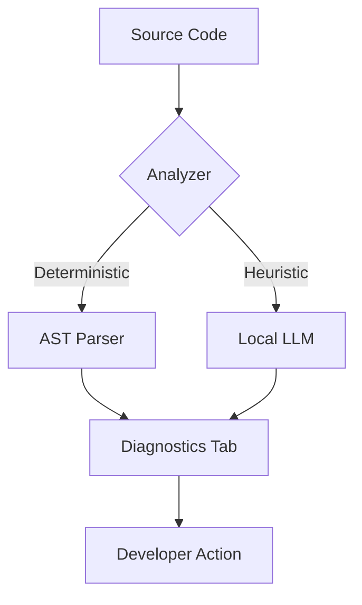

<div align="center">

# 🛡️ AI Code Scanner

### *Privacy-First, Local-LLM Powered Code Intelligence for VS Code*

[](https://www.google.com/search?q=https://marketplace.visualstudio.com/)
[](https://www.google.com/search?q=https://nodejs.org/)
[](https://www.google.com/search?q=https://opensource.org/licenses/MIT)
[](https://www.google.com/search?q=https://ollama.com/)

**Stop sending your proprietary code to the cloud.** AI Code Scanner combines deterministic AST-based analysis with local LLM orchestration to give you professional-grade insights right on your machine.

[Explore Features](https://www.google.com/search?q=%23-core-capabilities) • [Installation](https://www.google.com/search?q=%23-quick-start) • [Architecture](https://www.google.com/search?q=%23-under-the-hood)


</div>

## � VS Code Extension Conversion Guide

This project was converted from a CLI tool to a VS Code extension. Here's the complete transformation:

### Key Changes Made

#### 1. **Package.json Transformation**
- Converted from Node.js CLI to VS Code extension manifest
- Added extension metadata, activation events, and commands
- Configured context menus and keybindings
- Added VS Code-specific dependencies and scripts

#### 2. **Build System Overhaul**
- **Webpack Configuration**: Created `webpack.config.js` for bundling
- **TypeScript Config**: Updated `tsconfig.json` for extension development
- **Build Scripts**: Added compile, watch, package, and publish commands

#### 3. **Extension Architecture**
- **Entry Point**: `src/extension.ts` (replaces CLI `index.ts`)
- **Commands**: 4 main commands with VS Code integration
- **Output Channel**: Dedicated output panel for results
- **Context Menus**: Right-click integration for files

#### 4. **Development Setup**
- **VS Code Config**: `.vscode/` directory with launch and tasks
- **ESLint**: Code quality enforcement
- **Testing**: Basic test framework setup
- **Packaging**: VSCE integration for marketplace publishing

### Files Created/Modified

#### New Files:
```
webpack.config.js          # Webpack bundler config
.vscode/launch.json         # Debug configuration
.vscode/tasks.json          # Build tasks
.eslintrc.json             # Linting rules
.vscodeignore              # Packaging exclusions
test/index.ts              # Test runner
test/runTest.ts            # Test suite
CHANGELOG.md               # Version history
```

#### Modified Files:
```
package.json                 # Extension manifest
tsconfig.json              # TypeScript for extensions
src/extension.ts           # Main extension logic
README.md                  # Extension documentation
.gitignore                 # VS Code specific ignores
```

### Installation & Development

#### For Users:
```bash
# Install from marketplace or VSIX
code --install-extension ai-code-scanner-0.0.1.vsix
```

#### For Developers:
```bash
npm install
npm run watch      # Development mode
npm run compile    # Production build
npm run package    # Create .vsix file
npm run publish    # Publish to marketplace
```

### Extension Features

| Feature | CLI Version | Extension Version |
|---------|-------------|-------------------|
| Code Analysis | ✅ | ✅ Enhanced UI |
| AI Explanations | ✅ | ✅ Integrated |
| Security Scan | ✅ | ✅ Context menu |
| Documentation Gen | ✅ | ✅ File explorer |
| Output Display | Console | VS Code Panel |

---

## �🚀 Overview

**AI Code Scanner** is a lightweight VS Code extension designed for developers who demand high-performance static analysis without sacrificing privacy. By utilizing **Node.js** and local models like **Qwen2.5-Coder** via **Ollama**, this tool identifies security vulnerabilities, calculates complexity, and suggests refactors—all without an internet connection.

-----

## 🛠️ Core Capabilities

### 1\. 🔍 Code Understanding & Logic

  * **Contextual Explanations:** Get deep dives into complex functions and class hierarchies.
  * **Dependency Tracing:** Map out module imports and execution flows instantly.
  * **Entry Point Detection:** Quickly identify where the logic begins in unfamiliar codebases.

### 2\. 🛡️ Security & Guardrails

  * **Secret Detection:** High-entropy regex scanning for hardcoded API keys and tokens.
  * **Injection Prevention:** Real-time flagging of unsafe SQL and XSS patterns.
  * **Safe API Audits:** Detect deprecated or high-risk Node.js/Web API usage.

### 3\. 📊 Static Analysis (AST-Powered)

  * **Complexity Metrics:** Real-time calculation of **Cyclomatic Complexity ($M = E - N + 2P$)**.
  * **Code Smells:** Identify dead code, deep nesting, and "God Functions" before they hit production.
  * **Upgrade Intel:** Detect deprecated npm packages and breaking changes.

### 4\. 🧠 Local AI Suggestions

  * **Privacy-First Refactoring:** Local LLMs suggest performance improvements and readability wins.
  * **Pattern Recognition:** Suggestions for better design patterns (Singleton, Factory, etc.) tailored to your stack.

-----

## 📦 Installation

### Option 1: Install from VS Code Marketplace (Recommended)
1. Open VS Code
2. Go to Extensions (Ctrl+Shift+X)
3. Search for "AI Code Scanner"
4. Click Install

### Option 2: Install from VSIX (Development)
1. Download the `.vsix` file from releases
2. In VS Code: Extensions → Install from VSIX...
3. Select the downloaded `.vsix` file

### Option 3: Development Installation
```bash
git clone https://github.com/your-repo/ai-code-scanner.git
cd ai-code-scanner
npm install
npm run compile
```

Then in VS Code:
- Press `F5` to launch extension development host
- Or use `Ctrl+Shift+P` → "Debug: Start Debugging"

-----

## ⚙️ Configuration

Configure the extension in VS Code settings:

```json
{
  "aiScanner.llmEndpoint": "http://localhost:11434/api/generate",
  "aiScanner.model": "qwen2.5-coder",
  "aiScanner.maxFileSize": 1048576
}
```

**Required Setup:** Ensure Ollama is running locally:
```bash
ollama run qwen2.5-coder
```

-----

## 🚀 Usage

### Available Commands

| Command | Description | Context Menu |
|---------|-------------|--------------|
| `AI Code Scanner: Scan Current File` | Full analysis with AI insights | Right-click on file |
| `AI Code Scanner: Analyze for Code Smells` | Static analysis only | Right-click on file |
| `AI Code Scanner: Security Scan` | Security vulnerability check | Right-click on file |
| `AI Code Scanner: Generate Documentation` | Create project docs from scan results | Right-click on `scan-result.json` |

### How to Use

1. **Open any code file** in VS Code
2. **Right-click** in the editor → Select desired scan command
3. **View results** in the "AI Code Scanner" output panel
4. **For documentation**: Right-click on `scan-result.json` → "Generate Documentation"

### Output Panel

Results appear in VS Code's output panel with:
- 📁 File information and dependencies
- 🔧 Code smell analysis
- 🛡️ Security vulnerability reports
- 🤖 AI-powered explanations (when LLM is available)

-----

## ⚙️ How to Use Settings

The extension supports two LLM providers: **Ollama (Local)** and **ChatGPT (API)**. Configure your preferred provider using the guided setup or manual settings.

### Quick Setup (Recommended)

1. **Open Command Palette** (`Ctrl+Shift+P`)
2. **Run**: `AI Code Scanner: Configure LLM Provider`
3. **Choose Provider**: Select Ollama or ChatGPT
4. **Follow Prompts**: Enter required information

### Manual Configuration

Access settings via `File → Preferences → Settings` (or `Ctrl+,`), search for "AI Code Scanner":

#### For Ollama (Local AI)
```json
{
  "aiScanner.provider": "ollama",
  "aiScanner.ollama.url": "http://localhost:11434",
  "aiScanner.ollama.model": "qwen2.5-coder",
  "aiScanner.ollama.timeout": 30000
}
```

#### For ChatGPT (Cloud AI)
```json
{
  "aiScanner.provider": "chatgpt",
  "aiScanner.chatgpt.apiKey": "sk-your-api-key-here",
  "aiScanner.chatgpt.model": "gpt-4-turbo"
}
```

### Provider-Specific Settings

| Setting | Ollama | ChatGPT | Description |
|---------|--------|---------|-------------|
| `aiScanner.provider` | ✅ | ✅ | Active provider selection |
| `aiScanner.ollama.url` | ✅ | ❌ | Local server endpoint |
| `aiScanner.ollama.model` | ✅ | ❌ | Model name (auto-detected) |
| `aiScanner.ollama.timeout` | ✅ | ❌ | Request timeout (ms) |
| `aiScanner.chatgpt.apiKey` | ❌ | ✅ | OpenAI API key |
| `aiScanner.chatgpt.model` | ❌ | ✅ | GPT model selection |
| `aiScanner.maxFileSize` | ✅ | ✅ | Max file size to analyze |

### Testing Your Configuration

- **Ollama**: Use `AI Code Scanner: Test Ollama Connection` command
- **ChatGPT**: Configuration is validated during setup

### Troubleshooting

**Ollama Issues:**
- Ensure Ollama is running: `ollama serve`
- Check URL accessibility: `curl http://localhost:11434/api/tags`
- Verify model availability: `ollama list`

**ChatGPT Issues:**
- Confirm API key validity at [platform.openai.com](https://platform.openai.com/api-keys)
- Check account credits and rate limits

-----

## 🚀 How to Use This Extension

### Getting Started

1. **Install Prerequisites**
   ```bash
   # For Ollama users
   curl -fsSL https://ollama.ai/install.sh | sh
   ollama run qwen2.5-coder

   # For ChatGPT users - get API key from OpenAI
   ```

2. **Configure Provider** (see Settings section above)

3. **Start Scanning** your code!

### Available Commands

| Command | Shortcut | Description | When to Use |
|---------|----------|-------------|-------------|
| `AI Code Scanner: Scan Current File` | - | Full analysis with AI insights | Complete code review |
| `AI Code Scanner: Analyze for Code Smells` | - | Static analysis only | Quick quality check |
| `AI Code Scanner: Security Scan` | - | Security vulnerability check | Security audit |
| `AI Code Scanner: Generate Documentation` | - | Create project docs from scan results | Documentation creation |
| `AI Code Scanner: Configure LLM Provider` | - | Setup AI provider | Initial configuration |
| `AI Code Scanner: Test Ollama Connection` | - | Verify Ollama setup | Troubleshooting |

### Step-by-Step Usage

#### Method 1: Context Menu (Easiest)
1. **Open a code file** in VS Code editor
2. **Right-click** anywhere in the code
3. **Select** desired command from "AI Code Scanner" menu
4. **View results** in the output panel

#### Method 2: Command Palette
1. **Press** `Ctrl+Shift+P` (or `Cmd+Shift+P` on Mac)
2. **Type** "AI Code Scanner" and select command
3. **Follow prompts** if any

#### Method 3: File Explorer
1. **Right-click** on `scan-result.json` in explorer
2. **Select** "Generate Documentation"
3. **Choose** output format (folder structure or logical tree)

### Understanding Output

Results appear in the **"AI Code Scanner" output panel**:

```
🔍 Starting AI Code Analysis for: example.js
============================================================
📁 File: /path/to/example.js
🎯 Entry Point: Yes
📦 Dependencies: axios, lodash

🔧 Static Analysis (Code Smells):
✅ No code smells detected.

🛡️ Security Scanner:
✅ No security vulnerabilities detected.

🤖 Running Explain Code via Local LLM...
💡 This function implements a user authentication flow...
```

### Output Sections Explained

- **📁 File Info**: Basic file metadata and dependencies
- **🔧 Code Smells**: Static analysis results (complexity, patterns)
- **🛡️ Security**: Vulnerability scanning results
- **🤖 AI Analysis**: LLM-powered explanations and suggestions

### Advanced Usage

#### Batch Processing
- Use file explorer context menu on multiple files
- Results are shown per file in sequence

#### Documentation Generation
- Run scan on entire project first
- Use `scan-result.json` to generate comprehensive docs
- Output includes folder structure and logical component tree

#### Integration with Workflows
- Add to VS Code tasks for automated scanning
- Use in CI/CD pipelines with the CLI version
- Combine with other extensions for enhanced analysis

### Best Practices

1. **Start Small**: Test on individual files before project-wide scans
2. **Configure First**: Set up your LLM provider before heavy usage
3. **Review Results**: Don't blindly accept AI suggestions
4. **Regular Scanning**: Include in code review process
5. **Update Models**: Keep Ollama models current for best results

### Performance Tips

- **File Size Limit**: Large files may timeout - adjust `maxFileSize` if needed
- **Ollama Timeout**: Increase timeout for slower models or complex analysis
- **Local Models**: Use efficient models like `qwen2.5-coder` for speed
- **Caching**: Results are cached per session for faster re-analysis

-----

## 🛠️ Development

### Building the Extension

```bash
# Install dependencies
npm install

# Development build with watch mode
npm run watch

# Production build
npm run compile

# Package extension
npm run package

# Publish to marketplace
npm run publish
```

### Project Structure

```
src/
├── extension.ts          # Main extension entry point
├── ai/                   # LLM and prompt building
├── scanner/              # Analysis engines
├── chunker/              # Code chunking utilities
├── types/                # TypeScript definitions
└── utils/                # Helper functions
```

### Testing

```bash
# Run extension tests
npm test

# Debug tests
npm run test-debug
```

### Publishing

1. Update version in `package.json`
2. Build and test thoroughly
3. Create GitHub release
4. Run `npm run publish` (requires VSCE authentication)

-----

## 🏗️ Under The Hood

AI Code Scanner uses a **Hybrid Analysis Pipeline**:

1.  **Level 1: Regex & AST (Instant):** Fast, rule-based scanning for linting and simple security issues.
2.  **Level 2: Semantic Analysis (Local AI):** When high-level reasoning is needed (e.g., "Refactor this logic"), the scanner sends a structured prompt to your local model.

<!-- end list -->


-----

## 🔮 Future Scope: Documentation Generation

Based on the generated tree files (`folder-structure.md` and `project-logical-tree.json`), here are the types of comprehensive documentation that can be created:

### 1. Technical Architecture & System Design
Document the "Big Picture" of how the application functions with clear directory structure insights.
* **Component Hierarchy:** 
* **Service Layer Pattern:** 
* **Data Flow Diagrams:** 

### 2. API & Service Documentation
Create a "Developer Guide" foundation using the specialized services identified in the tree structure.
* **Task Management API:** 
* **AI Integration Guide:** 
* **Analytics Engine:** 

### 3. User Manual & Functional Guides
Write end-user documentation based on the file descriptions and component analysis.
* **Getting Started:** How to use.
* **Advanced Analytics:** How to interpret.
* **Using AI Features:** A guide on how to use features.

### 4. Maintenance & Onboarding Docs
Create resources for new developers joining the project using the folder structure insights.
* **Folder Structure Guide:** 
* **State Management:** 

### Summary of Documentation

| Sr. No. | Doc Type |
| :--- | :--- |
| 1. | **Logic & Data** |
| 2. | **AI Features** |
| 3. | **User Interface** |
| 4. | **Data Visualization** |

-----

## 🤝 Contributing

We love contributors\! If you want to add a scanner rule or improve the LLM prompt templates:

1.  Fork the Project.
2.  Create your Feature Branch (`git checkout -b feature/AmazingFeature`).
3.  Commit your Changes (`git commit -m 'Add some AmazingFeature'`).
4.  Push to the Branch (`git push origin feature/AmazingFeature`).
5.  Open a Pull Request.


<div align="center">

Built with ❤️ for the Developer Community.

[Back to top](https://www.google.com/search?q=%23-ai-code-scanner)

</div>

-----
