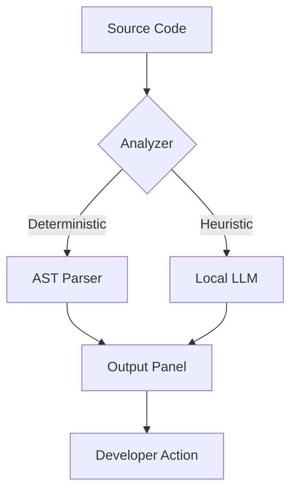

<div align="center">

# 🛡️ AI Code Scanner

### *Privacy-First, Local-LLM Powered Code Intelligence for VS Code*

**Stop sending your proprietary code to the cloud.** AI Code Scanner combines deterministic AST-based analysis with local LLM orchestration to give you professional-grade insights right on your machine.

[](https://marketplace.visualstudio.com/)
[](https://nodejs.org/)
[](https://opensource.org/licenses/MIT)
[](https://ollama.com/)

[📖 For Users](#-for-users) • [🛠️ For Developers](#-for-developers) • [📚 Additional Information](#-additional-information) • [🏗️ Architecture](#-under-the-hood)

</div>

---

## 📖 For Users

*Quick start guide for end users who want to install and use the extension.*

### 🚀 Quick Start
1. [Install the Extension](#installation)
2. [Configure Your LLM Provider](#configuration)
3. [Start Scanning Code](#usage)

### 📦 Installation

#### Option 1: VS Code Marketplace (Recommended)
1. Open VS Code (`Ctrl+Shift+X`)
2. Search for "AI Code Scanner"
3. Click **Install**

#### Option 2: Manual Installation
1. Download `.vsix` from [Releases](../../releases)
2. `Ctrl+Shift+P` → "Extensions: Install from VSIX"
3. Select downloaded file

### ⚙️ Configuration

#### Quick Setup (Recommended)
1. `Ctrl+Shift+P` → "AI Code Scanner: Configure LLM Provider"
2. Choose **Ollama** or **ChatGPT**
3. Follow the prompts

#### Manual Settings
Access via `File → Preferences → Settings` → Search "AI Code Scanner"

**For Ollama (Local AI):**
```json
{
  "aiScanner.provider": "ollama",
  "aiScanner.ollama.url": "http://localhost:11434",
  "aiScanner.ollama.model": "qwen2.5-coder"
}
```

**For ChatGPT (Cloud AI):**
```json
{
  "aiScanner.provider": "chatgpt",
  "aiScanner.chatgpt.apiKey": "sk-your-key-here",
  "aiScanner.chatgpt.model": "gpt-4-turbo"
}
```

### 🚀 Usage

#### Available Commands
| Command | Description | Access |
|---------|-------------|---------|
| `AI Code Scanner: Scan Current File` | Full analysis with AI | Right-click file |
| `AI Code Scanner: Analyze for Code Smells` | Static analysis only | Right-click file |
| `AI Code Scanner: Security Scan` | Security check | Right-click file |
| `AI Code Scanner: Generate Documentation` | Create docs from scan results | Right-click `scan-result.json` |

#### How to Scan Code
1. **Open a code file** in VS Code
2. **Right-click** → Select scan command
3. **View results** in "AI Code Scanner" output panel

#### Understanding Results
- 📁 **File Info**: Dependencies and metadata
- 🔧 **Code Smells**: Static analysis findings
- 🛡️ **Security**: Vulnerability reports
- 🤖 **AI Analysis**: LLM-powered insights

### 🆘 Troubleshooting

**Ollama Issues:**
- Ensure Ollama is running: `ollama serve`
- Test connection: `AI Code Scanner: Test Ollama Connection`

**ChatGPT Issues:**
- Verify API key at [platform.openai.com](https://platform.openai.com/api-keys)
- Check account credits

---

## 🛠️ For Developers

*Complete development guide for contributors and maintainers.*

### 🏗️ Development Setup

#### Prerequisites
- Node.js 18+
- VS Code
- Ollama (for local AI testing)

#### Installation
```bash
git clone https://github.com/your-repo/ai-code-scanner.git
cd ai-code-scanner
npm install
```

#### Development Workflow
```bash
# Start development mode
npm run watch

# Debug extension (F5 in VS Code)
# Or: Ctrl+Shift+P → "Debug: Start Debugging"

# Run tests
npm test

# Build for production
npm run compile

# Package extension
npm run package
```

### 📁 Project Structure
```
src/
├── extension.ts          # Main entry point
├── ai/                   # LLM integration
│   ├── llmClient.ts      # AI client wrapper
│   ├── promptBuilder.ts  # Prompt templates
│   └── llmSettings.ts    # Provider configuration
├── scanner/              # Analysis engines
│   ├── codeAnalyzer.ts   # Dependency analysis
│   ├── staticAnalyzer.ts # Code quality checks
│   ├── securityScanner.ts# Security scanning
│   └── fileScanner.ts    # File processing
├── chunker/              # Code chunking utilities
├── types/                # TypeScript definitions
└── utils/                # Helper functions

dist/                     # Compiled output
test/                     # Test files
.vscode/                  # VS Code configuration
```

### 🔧 Build & Release

#### Building
```bash
npm run compile    # Production build
npm run watch      # Development with watch
npm run package    # Create .vsix package
```

#### Publishing
```bash
# Update version in package.json
npm run publish    # Requires VSCE auth
```

### 🧪 Testing

#### Unit Tests
```bash
npm test
```

#### Integration Tests
```bash
npm run test-debug
```

#### Manual Testing
1. `F5` to launch extension host
2. Test all commands in new window
3. Verify output panel functionality

### 🤝 Contributing

#### Development Process
1. Fork the repository
2. Create feature branch: `git checkout -b feature/amazing-feature`
3. Make changes and test thoroughly
4. Commit: `git commit -m 'Add amazing feature'`
5. Push: `git push origin feature/amazing-feature`
6. Open Pull Request

#### Code Standards
- TypeScript strict mode
- ESLint configuration
- Comprehensive test coverage
- Clear commit messages

#### Adding New Features
- Update `package.json` commands if needed
- Add tests for new functionality
- Update documentation
- Follow existing code patterns

---

## 📚 Additional Information

*Detailed documentation, architecture, and future plans.*

### 🏗️ Under The Hood

AI Code Scanner uses a **Hybrid Analysis Pipeline**:

1. **Level 1: Deterministic (Instant)**
   - Regex pattern matching
   - AST-based static analysis
   - Rule-based security scanning

2. **Level 2: Semantic (AI-Powered)**
   - Local LLM for code understanding
   - Contextual explanations
   - Intelligent refactoring suggestions



### 🛠️ Core Capabilities

#### 1. 🔍 Code Understanding
- **Dependency Tracing**: Map imports and relationships
- **Entry Point Detection**: Identify application entry points
- **Function Analysis**: Understand complex logic flows

#### 2. 🛡️ Security & Safety
- **Secret Detection**: High-entropy pattern scanning
- **Injection Prevention**: SQL/XSS vulnerability detection
- **API Safety**: Deprecated function warnings

#### 3. 📊 Static Analysis
- **Complexity Metrics**: Cyclomatic complexity calculation
- **Code Smells**: Pattern-based quality analysis
- **Performance Insights**: Bottleneck identification

#### 4. 🧠 AI-Powered Features
- **Contextual Explanations**: Natural language code understanding
- **Refactoring Suggestions**: AI-driven improvement recommendations
- **Pattern Recognition**: Design pattern identification

### 🔮 Future Scope

#### Planned Features
- **Multi-language Support**: Python, Java, C#, Go
- **Custom Rules Engine**: User-defined analysis rules
- **Team Collaboration**: Shared scan results and insights
- **CI/CD Integration**: Automated scanning in pipelines

#### Documentation Generation
Based on scan results, generate:
- **Architecture Diagrams**: System component relationships
- **API Documentation**: Service and function references
- **User Guides**: Feature usage instructions
- **Maintenance Docs**: Onboarding for new developers

### 📋 API Reference

#### Extension Commands
```typescript
// Main scanning commands
vscode.commands.registerCommand('aiScanner.scan', scanCurrentFile)
vscode.commands.registerCommand('aiScanner.analyze', analyzeCodeSmells)
vscode.commands.registerCommand('aiScanner.securityScan', performSecurityScan)

// Configuration commands
vscode.commands.registerCommand('aiScanner.configureLLM', configureProvider)
vscode.commands.registerCommand('aiScanner.testOllamaConnection', testConnection)

// Documentation commands
vscode.commands.registerCommand('aiScanner.generateDocs', generateDocumentation)
```

#### Configuration Schema
```json
{
  "aiScanner.provider": "ollama" | "chatgpt",
  "aiScanner.ollama.url": "string",
  "aiScanner.ollama.model": "string",
  "aiScanner.ollama.timeout": "number",
  "aiScanner.chatgpt.apiKey": "string",
  "aiScanner.chatgpt.model": "string",
  "aiScanner.maxFileSize": "number"
}
```

### 🔗 Related Documentation

- [VS Code Extension API](../../docs/vscode-api.md)
- [LLM Integration Guide](../../docs/llm-integration.md)
- [Contributing Guidelines](../../CONTRIBUTING.md)
- [Changelog](../../CHANGELOG.md)
- [Security Policy](../../SECURITY.md)

### 📞 Support

- **Issues**: [GitHub Issues](../../issues)
- **Discussions**: [GitHub Discussions](../../discussions)
- **Documentation**: [Wiki](../../wiki)

---

<div align="center">

Built with ❤️ for the Developer Community

[⬆️ Back to Top](#-ai-code-scanner) • [📖 For Users](#-for-users) • [🛠️ For Developers](#-for-developers) • [📚 Additional Information](#-additional-information)

</div>
